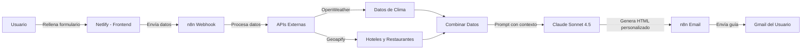

# 🐾 Patas y Rutas

<div align="center">


**Plataforma web que genera guías de viaje personalizadas pet-friendly usando IA**

[](https://github.com/npadilla-dev95/patas-y-rutas)
[](LICENSE)
[](https://patasyrutas.netlify.app)

[🌐 Demo en Vivo](https://patasyrutas.netlify.app) • [📖 Documentación](docs/ARCHITECTURE.md) • [🐛 Reportar Bug](https://github.com/npadilla-dev95/patas-y-rutas/issues)

</div>

---

## 📖 Sobre el Proyecto

**Patas y Rutas** nace de una necesidad real: viajar con mascotas no debería ser complicado. 

Como dueña de 3 perritos y 2 gatitos, he vivido la frustración de buscar durante horas hoteles que admitan mascotas, restaurantes con terraza, y lugares seguros para pasear. Este proyecto automatiza esa búsqueda y genera **guías personalizadas en minutos** usando IA y múltiples APIs en tiempo real.

### 🎯 ¿Qué problema resuelve?

- ⏰ **Ahorra tiempo**: De 3 horas de búsqueda manual a 5 minutos
- 🎨 **Personalización real**: Cada guía se adapta a tu mascota, destino y preferencias
- 🌤️ **Información en tiempo real**: Clima actual, hoteles disponibles, restaurantes abiertos
- 📧 **Resultados profesionales**: Recibes una guía en HTML con formato editorial por email

---

## ✨ Características Principales

| Característica | Descripción |
|----------------|-------------|
| 🤖 **IA Generativa** | Usa Claude Sonnet 4.5 para generar contenido personalizado y contextualizado |
| 🔄 **Automatización Completa** | n8n orquesta todo el flujo: formulario → APIs → IA → email |
| 🌍 **APIs en Tiempo Real** | OpenWeather (clima), Geoapify (lugares), datos actualizados al instante |
| 📱 **Diseño Responsive** | Funciona perfectamente en móvil, tablet y desktop |
| 📧 **Email Profesional** | Guías con diseño editorial listas para imprimir o compartir |
| ⚡ **Rápido y Eficiente** | Genera guías completas en menos de 30 segundos |

---

## 🛠️ Stack Tecnológico

### Frontend


### Backend & Automatización


### IA & APIs


### Deploy & Hosting


---

## 🏗️ Arquitectura del Sistema



### 📋 Flujo de Trabajo Detallado

1. **Usuario rellena formulario** → Destino, fechas, tipo de mascota, preferencias
2. **Webhook recibe datos** → n8n captura y valida la información
3. **Consulta APIs en paralelo**:
   - 🌤️ OpenWeather → Temperatura, clima, humedad
   - 🏨 Geoapify → Hoteles pet-friendly cercanos
   - 🍽️ Geoapify → Restaurantes con terraza
4. **Combina toda la información** → Crea contexto rico para la IA
5. **Claude genera guía personalizada** → HTML con contenido único según el perfil
6. **Envía email con diseño profesional** → Gmail del usuario con guía completa

---

## 🚀 Capturas de Pantalla

### Formulario Principal

*Interfaz intuitiva y responsive para capturar datos del viaje*

### Email Generado

*Guía personalizada con diseño editorial y datos reales*

### Workflow n8n

*Automatización completa visible y editable*

---

## 💻 Instalación y Configuración

### Requisitos Previos

- Cuenta en [n8n Cloud](https://n8n.io) (o instalación local)
- API Key de [Anthropic Claude](https://console.anthropic.com)
- API Key de [OpenWeather](https://openweathermap.org/api)
- API Key de [Geoapify](https://www.geoapify.com)
- Cuenta en [Netlify](https://netlify.com) para el frontend

### 🔧 Configuración Paso a Paso

1. **Clonar el repositorio**
```bash
git clone https://github.com/npadilla-dev95/patas-y-rutas.git
cd patas-y-rutas
```

2. **Configurar Frontend**
   - Sube la carpeta `frontend/` a Netlify
   - Configura el dominio personalizado (opcional)

3. **Importar workflow en n8n**
   - Abre n8n
   - Importa el archivo `n8n-workflows/patas-rutas-workflow.json`
   - Configura las credenciales:
     - Anthropic API Key
     - OpenWeather API Key
     - Geoapify API Key
     - Credenciales de Gmail

4. **Conectar Webhook**
   - Copia la URL del webhook de n8n
   - Pégala en el formulario frontend (`form.html` línea 120)

5. **¡Listo para usar!** 🎉

---

## 📂 Estructura del Proyecto

```
patas-y-rutas/
│
├── README.md                           # Este archivo
├── LICENSE                             # Licencia MIT
│
├── frontend/                           # Frontend estático
│   ├── index.html                      # Landing page
│   ├── form.html                       # Formulario de datos
│   ├── css/
│   │   └── styles.css                  # Estilos personalizados
│   ├── js/
│   │   └── main.js                     # Validación y lógica del formulario
│   └── assets/
│       └── images/                     # Imágenes del proyecto
│
├── n8n-workflows/                      # Workflows de automatización
│   └── patas-rutas-workflow.json       # Workflow exportado de n8n
│
├── docs/                               # Documentación adicional
│   ├── ARCHITECTURE.md                 # Arquitectura técnica detallada
│   ├── API_USAGE.md                    # Guía de uso de APIs
│   └── screenshots/                    # Capturas de pantalla
│       ├── form.png
│       ├── email-sample.png
│       └── n8n-workflow.png
│
└── examples/                           # Ejemplos
    └── email-template.html             # Ejemplo de email generado
```

---

## 🎓 Aprendizajes Clave

Durante el desarrollo de este proyecto aprendí:

- ✅ **Integración de APIs externas** y manejo de respuestas asíncronas
- ✅ **Automatización con n8n**: webhooks, transformación de datos, flujos condicionales
- ✅ **Prompting efectivo para IA generativa**: cómo estructurar prompts para obtener outputs consistentes
- ✅ **Gestión de errores** en sistemas distribuidos con múltiples puntos de fallo
- ✅ **Diseño responsive** sin frameworks, CSS puro y práctico
- ✅ **Debugging avanzado**: identificar y corregir errores en flujos complejos

### 💡 Desafíos Superados

1. **Sincronización de APIs**: Coordinar llamadas paralelas y esperar todas las respuestas
2. **Prompt engineering**: Conseguir que Claude genere HTML válido y consistente
3. **Manejo de datos faltantes**: Qué hacer cuando una API no devuelve resultados
4. **Formato de emails HTML**: Compatibilidad con diferentes clientes de correo

---

## 🗺️ Roadmap

### ✅ Fase 1: MVP (Completado)
- [x] Formulario funcional
- [x] Integración con Claude API
- [x] APIs de clima y lugares
- [x] Email con HTML básico
- [x] Deploy en Netlify

### 🚧 Fase 2: Mejoras (En progreso)
- [ ] Sistema de pagos con Stripe
- [ ] Dashboard de usuario para ver historial
- [ ] Descarga de guías en PDF
- [ ] Mapas interactivos con rutas

### 🔮 Fase 3: Escalado (Próximamente)
- [ ] App móvil (React Native)
- [ ] Integración con Booking.com Affiliate
- [ ] Sistema de reseñas de lugares
- [ ] Comunidad de viajeros con mascotas
- [ ] Soporte multiidioma

---

## 🤝 Contribuciones

¡Las contribuciones son bienvenidas! Si tienes ideas para mejorar el proyecto:

1. Haz fork del repositorio
2. Crea una rama para tu feature (`git checkout -b feature/nueva-funcionalidad`)
3. Commit tus cambios (`git commit -m 'Añade nueva funcionalidad'`)
4. Push a la rama (`git push origin feature/nueva-funcionalidad`)
5. Abre un Pull Request

### 🐛 Reportar Bugs

Si encuentras algún bug, por favor [abre un issue](https://github.com/npadilla-dev95/patas-y-rutas/issues) con:
- Descripción del problema
- Pasos para reproducirlo
- Comportamiento esperado vs actual
- Capturas de pantalla (si aplica)

---

## 📝 Licencia

Este proyecto está bajo la Licencia MIT. Ver el archivo [LICENSE](LICENSE) para más detalles.

---

## 👩‍💻 Sobre la Autora

**Natalia Ramírez Padilla**

Desarrolladora Web Junior apasionada por la automatización, la IA y crear soluciones que mejoren la vida de las personas (y sus mascotas 🐾).

Actualmente estudiando DAW y construyendo proyectos que combinan tecnología con problemas reales del día a día.

[](https://www.linkedin.com/in/natalia-ram%C3%ADrez-padilla-688449162)
[](https://github.com/npadilla-dev95)
[](mailto:irpadilla95@gmail.com)

---

## 💚 Agradecimientos

- A mis 3 perritos y 2 gatitos por inspirar este proyecto
- A la comunidad de n8n por la documentación y ejemplos
- A Anthropic por Claude, la mejor IA para generar contenido personalizado
- A todos los que viajan con sus mascotas y hacen del mundo un lugar más inclusivo 🐾

---

<div align="center">

**⭐ Si te gusta el proyecto, dale una estrella en GitHub ⭐**

Hecho con 💚 y 🐾 en Santiago de Compostela

</div>
